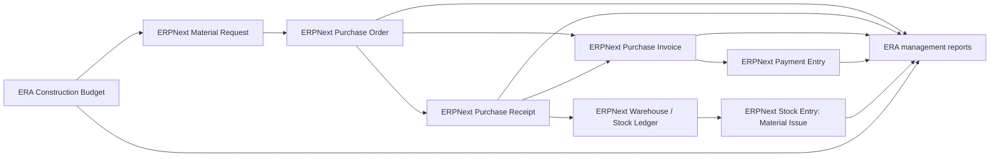

# ERA Construction Domain Model

- Status: **Proposed — architecture review required**
- Scope: management accounting and operational control for a construction/development company
- Baseline inspected: Frappe `16.30.0`, ERPNext `16.31.1`, ERA SOFT `0.1.0`
- Implementation gate: no domain implementation starts until this pack and the
  decisions in [07-open-questions.md](07-open-questions.md) are approved.

## Architectural position

ERA Construction is an extension of ERPNext, not a parallel ERP. ERPNext remains
authoritative for companies, projects, parties, items, procurement documents,
stock, invoices, payments and accounting ledgers. ERA SOFT adds only the
construction concepts that ERPNext cannot represent without losing their
business meaning.

The proposed transaction spine is:

```text
Project
  -> approved construction budget
  -> Material Request (purchase request)
  -> Purchase Order
  -> Purchase Receipt or service acceptance
  -> Purchase Invoice
  -> Payment Entry
  -> derived project cost and Budget vs Actual
```

The corresponding ownership boundary is:



ERA reports are projections over authoritative documents. They do not post a
second stock or general ledger.

## Inspection basis

The decision is based on the installed ERPNext source rather than entity names.
The following areas were inspected:

| Area | DocTypes/controllers inspected | Material finding |
| --- | --- | --- |
| Projects | `Project`, `Task`, project costing controller and project reports | Project already links purchases, invoices, timesheets and consumed material, but its aggregate cost fields are not a versioned construction cost model. |
| Buying | `Supplier`, `Material Request`, `Request for Quotation`, `Supplier Quotation`, `Purchase Order` and item rows | The standard chain preserves row-level request/order references and ordered/received/billed progress. A submitted PO creates a commercial commitment but no GL entry. |
| Stock | `Item`, `Warehouse`, `Purchase Receipt`, `Stock Entry`, stock ledger reports | Purchase Receipt records material arrival and stock value. Material Transfer moves value between warehouses. Material Issue/consumption is the appropriate project-cost event for stocked materials. |
| Accounts | `Budget`, new v16 budget controller, `Purchase Invoice`, `Payment Entry`, GL, Payment Ledger and Advance Payment Ledger | Standard Budget controls MR, PO and GL actuals by one dimension plus one P&L account. PI creates payable/accounting consequences; Payment Entry settles or advances and updates ledgers. |
| Assets | `Asset` and purchase asset processing | Suitable for company equipment and capital assets, not for construction blocks or work categories. |
| HR/payroll | `Employee`; installed-app and source inventory | Employee is present in ERPNext. Payroll DocTypes are not in this bench because the separate HRMS application is not installed. Payroll design therefore cannot be declared fit in this phase. |
| CRM | generic `Contract` only | Contract is relevant as a basic supplier agreement registry, but it lacks construction BOQ, variation, retention and progress-certificate semantics. Other CRM objects are not required by the MVP. |

## Sources of truth

| Concept | Authoritative record | ERA treatment |
| --- | --- | --- |
| Legal company | ERPNext `Company` | Reuse unchanged. |
| Construction project | ERPNext `Project` | Extend with a small construction field set and validation. |
| Block/floor cost object | ERPNext `Cost Center` tree | Configure under the project branch; extend only to associate a node with its project. |
| Work category | Proposed `ERA Work Category` tree | Custom master registered as an ERPNext Accounting Dimension. |
| Cost category | ERPNext `Account` tree | Use the posting/CWIP account as the MVP category; do not duplicate it initially. |
| Material/service | ERPNext `Item` | Stock items represent materials; non-stock items represent services/subcontract work. |
| Supplier/contractor | ERPNext `Supplier` | Contractor is a classification, not a duplicate party. |
| Site inventory | ERPNext `Warehouse` and Stock Ledger | Site and block warehouses are nodes in the company warehouse tree. |
| Accounting liability | Purchase Invoice, Payment Ledger and GL | ERPNext remains authoritative for payable and settlement. |
| Construction budget | Proposed `ERA Construction Budget` plus child lines | Custom because the required multidimensional, quantity/rate and version model is not expressible by standard Budget. |
| Budget enforcement envelope | ERPNext `Budget` | Optionally generated/configured at Project-or-Cost-Center × Account level for Warn/Stop controls. |
| Project cost, commitment and paid cost | Derived ERA reports | Calculated from ERPNext transactions; no custom transaction ledger in the MVP. |

## Core decisions

### 1. Project is the development/construction project

`Project` represents `EcoCity Ayni`, not every block and not every contract. It
already carries company, dates, status, project permissions, cost center and
transaction links. ERA extensions should be limited to fields such as project
kind, site address/location, project manager and default site warehouse.

### 2. Cost Center is the block-level cost object

The company Cost Center tree provides the physical/cost hierarchy needed for
financial aggregation:

```text
Construction Projects - ERA
  EcoCity Ayni - ERA
    Block A - ERA
    Block B - ERA
```

Floors become Cost Center leaves only when ERA will budget, approve and post
costs by floor. Otherwise they remain operational detail and are deferred. This
avoids creating a second Building/Block hierarchy that transactions cannot use.

### 3. Work Category is an Accounting Dimension

Foundation, frame, masonry, facade, engineering and finishing are independent
of blocks. Encoding them below each block in Cost Center would prevent clean
cross-analysis and create duplicate master data. A small tree DocType,
`ERA Work Category`, should therefore be registered as an ERPNext Accounting
Dimension. ERPNext then creates link fields on supported purchase, stock,
accounting and ledger rows without a core change.

### 4. Account is the initial cost category

Materials, subcontracting, labor, equipment, permits and other cost types should
start as a controlled Account hierarchy. A separate `ERA Cost Category` would
duplicate the chart of accounts and complicate reconciliation. It may be added
later only if management needs a stable cross-account taxonomy that differs
materially from statutory/CWIP accounts.

### 5. Construction Budget is custom; ledgers are not

ERPNext v16 Budget has strong control features, including budget revision,
period distributions and cumulative controls over Material Requests, Purchase
Orders and actual GL expenses. Its grain is nevertheless one budget dimension
and one P&L account per record. It cannot store one approved package containing
Project × Block × Work Category × Account × Item lines, quantities/rates and
baseline/current versions. It also rejects balance-sheet accounts, which is a
critical gap when construction cost is capitalized to CWIP or inventory.

The custom budget is the management baseline. Standard ERPNext Budget may be
used as a coarser enforcement envelope, but it is not the construction budget
source of truth.

### 6. Project Cost is a derived fact

An `ERA Project Cost` transaction DocType is not justified for the MVP. Actual
cost should be derived from:

- Purchase Invoice items for accepted non-stock services and direct purchases;
- Stock Entry `Material Issue` rows for material consumed from site inventory;
- Timesheets for labor where that policy is approved;
- payroll allocations only after HRMS is separately evaluated;
- explicit accounting adjustments carrying the required dimensions.

This distinction prevents a Purchase Receipt into inventory from being reported
as consumed project cost and prevents accounting expense from being treated as
the only possible management-cost source.

### 7. Payment status is derived, not an accounting dimension

Ordered, delivered, invoiced, outstanding, advanced and paid amounts come from
the procurement chain, Payment Ledger and Advance Payment Ledger. They change
over time and must not be copied into static classification masters.

## Permission and workflow posture

The standard permissions are usable but too broad for ERA's approval policy:

- standard Purchase Users can submit/cancel Material Requests and Purchase
  Orders;
- Stock Users can submit/cancel receipts and stock entries;
- Accounts Users can submit/cancel invoices and payments;
- Purchase Order and Purchase Receipt apply ERPNext Authorization Control by
  amount, but this does not replace a named business workflow;
- Project user sharing controls project visibility, while financial reports
  still require role and User Permission design.

The MVP should configure Frappe Workflows for request and order approval, narrow
role permissions, and use User Permissions for company/project access. Custom
server validation is reserved for cross-field integrity such as “Block belongs
to Project” and “Budget Line is approved”; it must not recreate the workflow
engine.

## Explicit non-decisions

This architecture does not yet approve:

- a construction contract valuation/retention subsystem;
- a custom project cost ledger;
- floor-level accounting everywhere;
- payroll implementation or HRMS installation;
- supplier provenance for consumed fungible stock;
- production data migration;
- a custom construction workspace or large UI.

Those items require the business decisions recorded in
[07-open-questions.md](07-open-questions.md).
