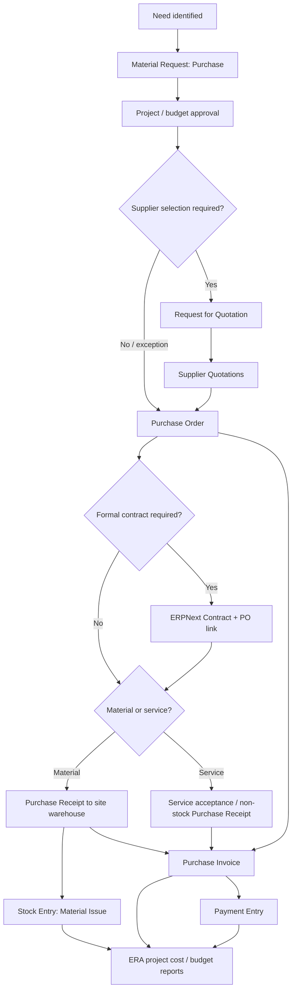

# Procurement, Delivery and Payment Workflow

## Minimum common flow



The standard document links must be used end-to-end. Creating an unrelated PO,
receipt or invoice and copying a reference into remarks is not acceptable.

## Step design

| Step | Standard record | Required ERA control | Key outcome |
| --- | --- | --- | --- |
| Need | Draft `Material Request` type Purchase | Project, block, Work Category, cost Account, Budget Line, required date, justification | Costed need with source dimensions. |
| Request approval | Frappe Workflow on Material Request | Site Manager → Project Manager/Budget Owner; threshold exception where needed | Submitted approved need; no accounting entry. |
| Supplier selection | RFQ and Supplier Quotation, or documented exception | Minimum bids/sole-source reason and attachment policy | Auditable selected supplier/offer. |
| Order | `Purchase Order` mapped from MR/SQ | Preserve dimensions and Budget Line; Procurement prepares; Project/Finance approve; optional Contract link | Submitted commercial commitment with delivery/payment schedule. |
| Material delivery | `Purchase Receipt` mapped from PO | Site receiver, site warehouse, accepted/rejected quantity, delivery note, optional quality inspection | Received quantity and Stock Ledger value; PO progress. |
| Service confirmation | non-stock `Purchase Receipt` mapped from PO | Authorized engineer confirms quantity/milestone; no stock Item | Accepted-service progress; PO received percentage. |
| Material consumption | `Stock Entry` Material Issue | Site warehouse source, Project/block/work/account/Budget Line, receiver/purpose | Valued material actual and reduced site stock. |
| Invoice | `Purchase Invoice` mapped from PO/receipt | Three-way/two-way match, bill number/date, tax, due date and dimensions | Supplier payable and accounting actual according to cost policy. |
| Payment | `Payment Entry` mapped to PI or PO advance | Finance approval, bank/cash mode, reference number/date, allocation | Settled payable or recorded advance; paid-cost/cash view. |

## Material path

### Purchase request and order

Use stock Items with controlled UOM. The Material Request row already contains
Item, quantity, schedule date, target Warehouse, Project, Cost Center and
expense account; Work Category and Budget Line are the required extensions.
Mapping to PO preserves `material_request` and `material_request_item` links.

The PO line holds ordered amount, target Warehouse, Project, Cost Center,
received quantity, billed amount and source quotation/request. Submission is the
commitment event. It does not create stock or GL entries.

### Receipt

Create Purchase Receipt from PO. Require:

- actual site/block warehouse;
- supplier delivery-note reference;
- accepted, rejected and returned quantities where applicable;
- Project/block/work dimensions copied and validated from PO;
- quality inspection only for item groups where policy demands it.

With perpetual inventory, a stock receipt normally posts inventory against
Stock Received But Not Billed and updates Stock Ledger. It is **delivered value**,
not consumed project actual.

### Transfer and consumption

Central-to-site movement uses Stock Entry `Material Transfer`. It must remain a
stock movement in management reports. Site consumption uses `Material Issue`
and carries the project dimensions on each row. Stock valuation determines the
material actual; a manual purchase-price copy is forbidden.

### Invoice

Create Purchase Invoice from Purchase Receipt/PO so `purchase_order_item` and
`purchase_receipt_item` links remain intact. When a Purchase Receipt already
handled stock, `update_stock` on the PI must be disabled. The invoice creates
the supplier payable, tax and the appropriate stock-received-not-billed
clearing/variance effects.

## Service / subcontract path

Use non-stock Items for repeatable service categories (excavation, masonry,
design, equipment hire). This retains quantities/UOM, supplier rates, dimensions
and standard procurement links.

For the MVP:

1. Material Request type Purchase records the service need.
2. PO carries scope, quantity/rate or milestone item, Contract link and payment
   schedule.
3. An authorized engineer creates a non-stock Purchase Receipt as service
   acceptance when acceptance before invoicing is required.
4. Purchase Invoice is mapped from accepted quantities or directly from PO for
   simple services where two-way match is approved.
5. PI creates management actual and payable; Payment Entry creates paid cost.

The pilot must explicitly test the company's “provisional accounting for
non-stock items” setting because a non-stock Purchase Receipt can create
service-received-not-billed/expense entries. If ERA does not want accrual at
acceptance, that setting and the report source policy must reflect it.

Construction BOQ measurement, progress certificates, retention release,
variations and claims are not hidden inside this simple flow. They are a later
contract-management slice after business rules are approved.

## Supplier selection

Standard RFQ/Supplier Quotation is recommended when competitive sourcing is
required. The PO line can retain its Supplier Quotation reference. The MVP may
allow a controlled exception route for urgent/sole-source purchasing, but the
request must record:

- selection method;
- selected quotation or supplier;
- reason for exception;
- approving role;
- supporting attachment.

A custom bid-scoring module is not part of this phase.

## Contract handling

The generic ERPNext Contract is acceptable as an MVP registry for signed terms:

- party type Supplier;
- project, contract type, dates and agreed value through ERA fields;
- signed document attachment/terms;
- status and fulfilment checklist;
- `era_contract` link on each related Purchase Order.

The PO-side link is required because one generic Contract record can reference
only one standard document while a construction contract may drive many POs.
Do not implement BOQ/retention/variation logic until the open questions are
answered.

## Payment and payable control

ERPNext already provides the authoritative layers:

| Management question | Source |
| --- | --- |
| What was requested? | submitted Material Request item balance |
| What was ordered? | active submitted Purchase Order items |
| What was delivered/accepted? | submitted Purchase Receipt items and PO `per_received` |
| What was invoiced? | submitted Purchase Invoice items and PO/receipt billed status |
| What remains payable? | Purchase Invoice outstanding and Accounts Payable/Payment Ledger |
| What was paid? | submitted Payment Entry allocations / Payment Ledger |
| What is an advance? | Payment Entry against PO or unallocated Supplier payment / Advance Payment Ledger |
| What is on site? | Stock Balance/Stock Ledger by site warehouse |
| What was consumed? | valued Material Issue Stock Entry rows |

ERA should add a read-only **Procurement and Payment Control** report with one
drillable chain and these columns:

```text
Project | Block | Work Category | Budget Line | Supplier | PO
Ordered | Delivered | Accepted | Invoiced | Advance | Paid
Outstanding | Unreceived | Uninvoiced | Due Date | Payment Status
```

This is a report, not a new transaction DocType.

## Advances

Supplier advance is made by Payment Entry referencing Purchase Order or as an
unallocated Supplier payment, according to the approved accounting setting.
Later reconciliation applies it to Purchase Invoice. Reports must distinguish:

- advance requested (if a payment-request workflow is adopted later);
- advance paid;
- advance allocated to invoices;
- unallocated supplier advance;
- refund/reversal.

An advance is cash paid but is not automatically project actual. It reduces
future cash requirement only when allocated under the approved policy.

## Project cash requirement

The forecast report should use source precedence to prevent double counting:

1. unpaid submitted PI payment-schedule amounts (highest certainty);
2. less available advances allocated/eligible for those invoices;
3. uninvoiced active PO payment-schedule balance;
4. approved budget remaining not yet requested/ordered (planning layer).

Each layer is shown separately by due/expected month. Historical cash remains
the standard Cash Flow/GL view.

## Proposed roles and workflow states

| Role | Primary authority |
| --- | --- |
| ERA Requester | Draft requests; no submit/approve. |
| ERA Site Receiver | Draft receipts/issues for assigned site; no commercial approval. |
| ERA Project Manager | Approve project need and acceptance within threshold. |
| ERA Procurement User | RFQ, quotation and PO preparation. |
| ERA Procurement Manager | Supplier selection and PO commercial approval. |
| ERA Finance User | PI and Payment preparation/reconciliation. |
| ERA Finance Manager | Financial/budget exception and payment approval. |
| ERA Construction Director | High-value/over-budget approval and management reports. |
| ERA Auditor | Read-only source and audit reports. |

Suggested request states:

```text
Draft -> Pending Project Approval -> Pending Budget Approval
      -> Approved -> Ordered / Partially Ordered -> Closed
      -> Rejected / Cancelled
```

Suggested PO states:

```text
Draft -> Pending Procurement Approval -> Pending Financial Approval
      -> Approved/Submitted -> To Receive and Bill -> Completed/Closed
      -> Rejected / Cancelled
```

Standard ERPNext document status continues to control ledger behavior. Workflow
state must not counterfeit submission or cancellation.

## Minimum control rules

- Project, block, Work Category, Account and approved Budget Line are mandatory
  for direct construction rows.
- Source dimensions must map forward; changes require an approved reason.
- Supplier, Project and currency must agree across mapped documents.
- Received/invoiced quantity cannot exceed the configured tolerance.
- PI without PO/receipt requires an exception workflow.
- Material PI must not update stock after Purchase Receipt.
- Payment cannot exceed approved outstanding/advance policy.
- Cancellation/amendment must reverse report measures and retain audit history.
- No transaction is considered approved from a custom checkbox alone.
